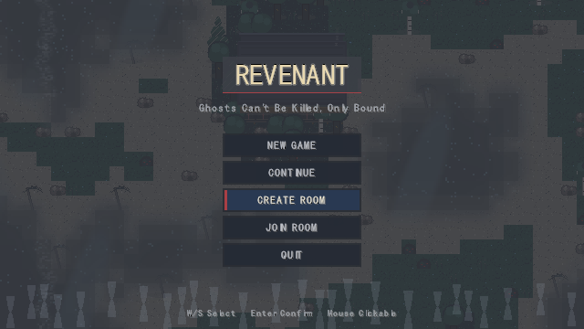
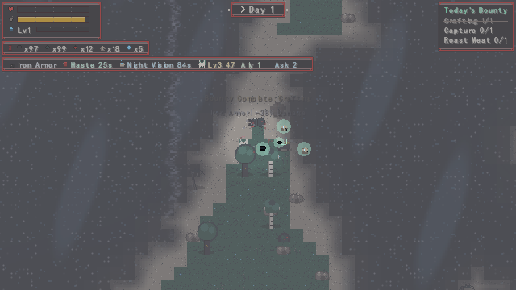
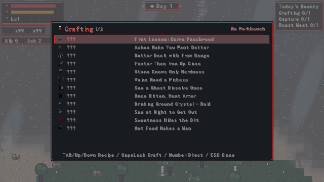
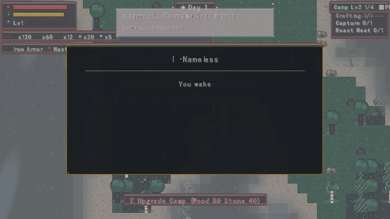
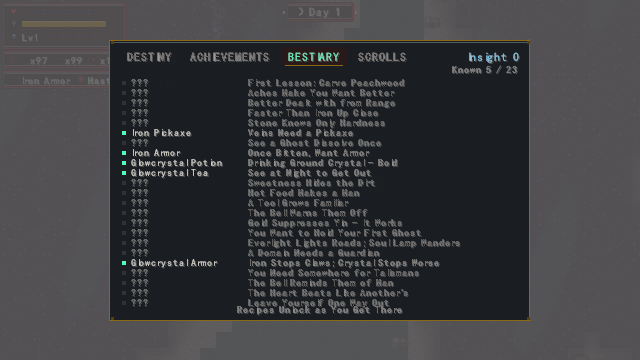
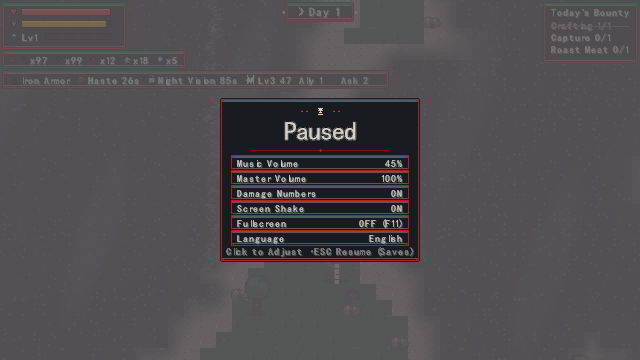
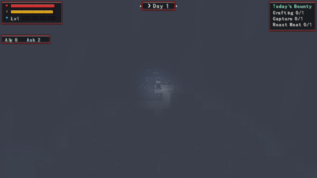
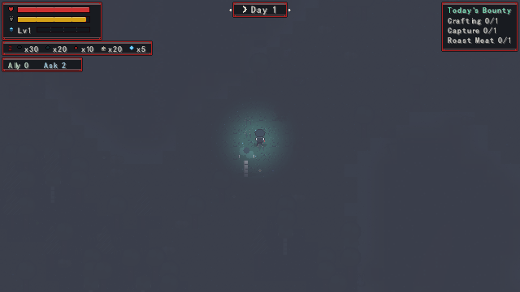

# Revenant (还魂人 · Huanhun Ren)

A 2D top-down pixel **survival** game with a Chinese folk-horror twist, written in **C++17 + raylib 5.5**.

**Zero external assets.** There is no sprite sheet, no image file, no audio file, not even a font binary in this repository. Every sprite is painted from a palette + pixel-string description, every sound effect is synthesised from raw PCM waveforms at startup, and Chinese glyphs are rasterised on demand from the system font. What you clone is what the game runs on.

[中文说明](README.zh-CN.md) · [MIT License](LICENSE)

---

## Highlights

- **Ghost-rule horror instead of stat checks.** Every ghost rolls 1–2 *rules* at spawn from an 11-rule pool (35% chance of a second one). Until you trigger its rule, a ghost is neutral and harmless. Triggered, it is hostile forever — *it remembers you*. Two identical-looking ghosts can have completely different rules, so you have to read the two characters floating above its head, not memorise a table.
- **Ordinary weapons cannot hurt the dead.** You are alive; your sword does 0 damage to anything ghostly. You either avoid it by rule, or you fight ghosts *with* ghosts — catch souls with your banner and send your ghost servants in.
- **Bi-lingual, switch in-game.** Chinese (default) and English, stored in `lang.cfg`. Every player-facing string goes through one translation layer; see [Localisation](#localisation).
- **Everything is procedural.** Terrain is value-noise islands rendered once into a 2560×2560 texture; the day/night cycle runs 2 minutes of day to 1 of night; the water shader reflects whatever is in the sky.
- **Pixel-perfect by construction.** 640×360 internal resolution scaled by an integer factor, all textures `NEAREST`, camera coordinates floored.

---

## Screenshots

All eight were exported by the game's own headless screenshot pipeline, so they are the real frames, not mock-ups.

<table>
  <tr>
    <td></td>
    <td></td>
  </tr>
  <tr>
    <td align="center">Title screen — English mode</td>
    <td align="center">HUD: vitals, buffs, companion, daily bounty</td>
  </tr>
  <tr>
    <td></td>
    <td></td>
  </tr>
  <tr>
    <td align="center">Crafting panel — 14 recipes across 2 pages</td>
    <td align="center">A warded camp at night</td>
  </tr>
  <tr>
    <td></td>
    <td></td>
  </tr>
  <tr>
    <td align="center">Codex — bestiary page unlocks as you play</td>
    <td align="center">Pause panel — including the language switch</td>
  </tr>
  <tr>
    <td></td>
    <td></td>
  </tr>
  <tr>
    <td align="center">Night light map — lantern and campfire falloff</td>
    <td align="center">A founded territory</td>
  </tr>
</table>

---

## Build

### Windows, one click

Double-click **`build.bat`**. It produces `game.exe` and copies `raylib.dll` beside it.

The script assumes:

| Dependency | Default location | Fallback |
|---|---|---|
| MinGW-w64 `g++` | `D:\codetool\mingw64\bin\g++.exe` | `g++` on `PATH` |
| raylib 5.5 (MinGW-w64) | `D:\codetool\raylib-5.5_win64_mingw-w64` | auto-searches `D:\codetool\raylib*`, `D:\raylib*`, `D:\*\raylib*` |

If your toolchain lives somewhere else, edit the three `set` lines at the top of `build.bat`.

### CMake + Ninja

```bat
cmake -B build -G Ninja ^
  -DCMAKE_BUILD_TYPE=Release ^
  -DCMAKE_C_COMPILER=<mingw>/bin/gcc.exe ^
  -DCMAKE_CXX_COMPILER=<mingw>/bin/g++.exe ^
  -DCMAKE_MAKE_PROGRAM=<ninja>/ninja.exe
cmake --build build
```

### Manual

```
g++ main.cpp world.cpp creature.cpp assets.cpp audio.cpp water.cpp \
    progress.cpp net.cpp l10n.cpp \
    -o game.exe -std=c++17 -O2 -Wall \
    -I<raylib>/include -L<raylib>/lib \
    -lraylibdll -lopengl32 -lgdi32 -lwinmm -lws2_32
```

> All nine translation units are required. `progress.cpp` and `net.cpp` are easy to forget; dropping them fails at link time. The dynamic build needs `raylib.dll` next to the executable.

---

## Controls

| Key | Action |
|---|---|
| `W A S D` | Move (8-way, 120 px/s) |
| `Shift` | Sprint (170 px/s) |
| `J` / Left mouse | Attack (cone hitbox, 0.35 s cooldown). Confirm slot while the radial bar is open |
| `F` | Toggle the ghost bar; inside it, left click sends a servant out, right click recalls |
| Mouse wheel | Open the radial item bar and cycle slots (auto-closes after 2.2 s idle) |
| `1`–`9`, `0` | Select slot (`1`–`7` jump straight to a recipe while crafting) |
| `Q` | Mark / unmark the nearest ghost — a marked ghost keeps its rule visible |
| `B` | Banner panel: full ghost-catching parameters |
| `N` | Plant a boundary stone and found a territory where you stand (wood ×30 + stone ×15) |
| `K` | Question the nearest companion (2/day, +1 per territory level). Press again within 4 s to banish them |
| `E` | Context interact: blacksmith / interactable ghost / survivor / **boundary stone (found, upgrade)** / bed (sleep) |
| `X` | Talisman ring — wheel to switch, left click to use |
| `Tab` | Open/close the forging panel; cycles through all 14 recipes (crosses pages) |
| `CapsLock` / `Enter` | Craft the selected recipe |
| `↑` / `↓` | Move through recipes |
| `C` | Craft and place a lantern (wood ×5) |
| `G` | Cook raw meat into cooked meat next to a lantern |
| `T` | Tame a nearby rabbit or deer with raw meat (×1) |
| `P` | Re-open the tutorial card |
| `[` / `]` | BGM volume down / up (10% steps) |
| `Esc` | Pause / resume — the settings panel, including the language switch |
| `R` | Restart with a freshly generated world after death |

---

## Game systems

### Loop

Gather → survive → fight → ward your camp → delve. Hunger drains 1 per 3 s; at zero, health drops 5 per 2 s; above 80 it slowly regenerates. Death shows *days survived* and *kills*, then `R` restarts.

### Catches, not corpses

Attack a ghost and you deal **0 damage** — a splash of red text and green will-o'-wisp sparks tells you why. Ghosts are caught, not killed: hold the soul banner, press `V` near a wandering soul, and it becomes a servant that *can* hurt the dead. The blacksmith ghost bound to your side cannot be damaged or dispersed by anything — attacking it only earns you the line *"it cannot be killed"*.

### Wards and talismans

The player's only direct way to hurt a ghost. Eight of each, independent cooldowns.

| Talisman | Effect | Cooldown |
|---|---|---|
| Binding | Freeze the nearest ghost for 3 s | 8 s |
| Expelling | Knock it back and force it to **re-lurk** (clears its triggered state) | 10 s |
| Sealing | Paste onto the nearest wooden wall; the wall absorbs one hit | 12 s |
| Thunder | **50 direct damage** to a ghost | 6 s |
| Concealing | For 8 s, **no rule can trigger** | 22 s |

Digging up graves yields a random talisman 45% of the time.

### The faceless

A lurking faceless ghost that stays within 96 px of you for a cumulative 6 s slips into your party as a "follower" — provided somebody else already travels with you. It never turns hostile and never reveals itself. Every 24 s it replaces the nearest real companion within 140 px, and the replacement is itself a faceless one. The party is quietly swapped out, one member at a time.

You die when companions number more than 5 and the faceless share reaches 50% (30% once your territory is level 2). At territory level 1 a faceless ghost still betrays a blank face; from level 2 even that tell is gone.

The only way to catch one is **questioning** (`K`): ask the nearest "person" which day it is. Real companions answer correctly; a faceless one is off by 2–3 days. Press `K` again within 4 s to banish them — right, and a faceless ghost is gone; wrong, and a real companion leaves you for good.

### Stalked, and the sounds

Stay indoors 25 s after nightfall and you hear three knocks. From then on you are **stalked**: ghosts ignore their own rules and charge you every 9 s. Your options are talismans, your servants, or holding out until dawn.

15% of ghosts are sound-bound. Every 7 s they make a noise; hear it within 220 px and they lock onto you regardless of rule, with a red directional arrow and distance at the screen edge for 2.2 s.

### Ghost rules

A ghost is neutral until its rule fires. Learn the rule and you walk past it alive.

| Ghost | Rule | Fires when | How to live |
|---|---|---|---|
| Wandering Soul | only at night | night | travel by day |
| Skittering Corpse | chases the fast, not the slow | you are sprinting | stop pressing `Shift` |
| Corpse King | smells blood | night and (HP < 50% or blood moon) | stay healthy |
| Paper Man | lunges at close range | distance < 44 | keep your distance |
| Spider Ghost | comes to the web | distance < 72 | walk around it |
| Tomb Guardian | death to trespassers | distance < 64 | stay out of the graveyard |
| Night Owl | strikes at movement | night and you are moving | stand still in the dark |
| Acid Spitter | turns on those who strike it | it has been hit | don't hit it |
| Stone Sentinel | never look back | you are facing away | face it |
| Drowned Ghost | appears near water | you are close to water | stay away from the shore |
| Soul Weaver | watches you use things | you use an item near it | use nothing near it |
| Blood-Moon King | the blood moon rises | blood-moon night | stay inside that night |

> Attacking a ghost is itself a trigger — 0 damage, but you have just activated its rule.

### Territory

Plant a boundary stone (`N`) to found a territory: it raises a ring of wooden walls with a gap to the southeast, a straw bed, and a lantern. Upgrade by standing within 64 px of your own stone and pressing `E`; both the companion count and the materials must be met.

| Level | Companions | Materials | Effect |
|---|---|---|---|
| 1 → 2 | ≥ 2 | wood ×40 + stone ×25 | capacity 4; 3 questions/day; **faceless death threshold drops to 30%**, and infiltrators lose all tells |
| 2 → 3 | ≥ 4 | wood ×80 + stone ×40 + iron ×10 | capacity 6; 4 questions/day |

### Crafting

Seven recipes on the surface page, seven more at the workbench. `Tab` cycles through all fourteen, `CapsLock` confirms, `1`–`7` jump straight to one. The animation runs in three stages: materials fly out to ring positions around the bench, collide toward the centre one by one, then fuse in a flash.

---

## Localisation

The game ships bi-lingual; **Chinese is the default**. Switch at runtime in the pause/settings panel (last row). The choice is written to `lang.cfg` next to the executable and applied before anything is drawn.

Implementation: every player-facing string is looked up through `L10N()` (`l10n.h` / `l10n.cpp`), which is hooked into the two drawing entry points — `ZhTextStyled()` and `ZhWidth()` — so call sites stay untouched.

```
L10N(const char* s)   // Chinese source string in, English out. Returns s unchanged on miss or in Chinese mode.
```

- In Chinese mode `L10N()` returns immediately; there is no per-frame cost.
- Runtime-composed strings (`TextFormat`) keep their original format string so the lookup key still matches.
- The table is a **static sorted array searched with `strcmp` binary search** — no heap, no static-init order problems, 811 entries.

To change or add strings:

```bash
node tools/extract_zh.js      # which Chinese literals still lack a translation (and which keys went stale)
node tools/gen_l10n.js        # rebuild l10n.cpp / l10n.h from tools/translations.json
```

`tools/translations.json` is the single source of truth for the English text (`"中文原串": "English"`). Keep the keys byte-identical to the C++ literal — `%d` / `%s` placeholders and `\n` included — or the lookup silently misses and the game falls back to Chinese.

---

## Project layout

```
main.cpp          player, combat, hit feedback, particles, UI, main loop, render pipeline
world.hpp/cpp     value-noise terrain, object grid, graveyard generation, drops, circle-collision sliding
creature.hpp/cpp  creature state-machine AI (7 graveyard species + the blood-moon boss)
assets.hpp/cpp    palette pixel art + procedural textures (player / creatures / tiles / objects / UI / FX)
audio.hpp/cpp     PCM-synthesised sound effects (square / saw / noise + envelopes)
water.hpp/cpp     water shader (waves, reflections, rain ripples, celestial reflection)
progress.hpp/cpp  progression: paths, achievements, bestiary, scrolls, save/load
net.hpp/cpp       LAN co-op
l10n.hpp/cpp      translation table (generated) + lookup
tools/
  translations.json  Chinese -> English map (811 entries) — edit text here
  gen_l10n.js        regenerates l10n.cpp / l10n.h
  extract_zh.js      translation coverage report
build.bat         one-click build
CMakeLists.txt    CMake + Ninja build
gen_zhtext.py     regenerates the Chinese glyph pool in main.cpp
check_zh.py       verifies glyph coverage
```

---

## Development tooling

### Headless UI verification

Window capture is unreliable on some machines (fullscreen apps steal focus), so the game can dump its own GPU render target straight to PNG. It runs a scripted ~1750-frame sequence and exports each screen.

```
g++ main.cpp world.cpp creature.cpp assets.cpp audio.cpp water.cpp \
    progress.cpp net.cpp l10n.cpp -o game_dbg.exe \
    -std=c++17 -O2 -Wall -DDEBUG_HEADLESS -DDEBUG_AUTO_SHOT \
    -I<raylib>/include -L<raylib>/lib \
    -lraylibdll -lopengl32 -lgdi32 -lwinmm -lws2_32
game_dbg.exe > dbg_run.log 2>&1
```

Exported PNGs are upright and already at the game's internal 640×360 resolution, so they diff cleanly between runs. The eight images under `screenshots/` came straight out of this pipeline.

### Behaviour regression suite

`main.cpp` carries a set of assertions behind `DEBUG_VERIFY` covering the historical bugs — dungeon restart, gathering underflow, crafting animation advance, death radial bar, `NewGame` state reset, the bound blacksmith ghost, ghost-domain entry/exit, save round-trip, multi-target sweep, the unkillable blacksmith ghost, faceless infiltration and replacement, the death threshold, and the territory double gate.

```
g++ ... -DDEBUG_HEADLESS -DDEBUG_VERIFY -o pw_verify.exe ...
pw_verify.exe | grep VERIFY     # expect VERIFY1..VERIFY21 all PASS
```

### Chinese glyph maintenance

Every Chinese character used in-game must be registered in the `ZHTEXT` constant in `main.cpp`; a missing one renders blank. After adding or editing any Chinese text:

```
python gen_zhtext.py     # rescan all sources, rebuild ZHTEXT
python check_zh.py       # expect "no missing glyphs"
```

---

## License

[MIT](LICENSE). Use it, modify it, ship it — keep the copyright notice.
